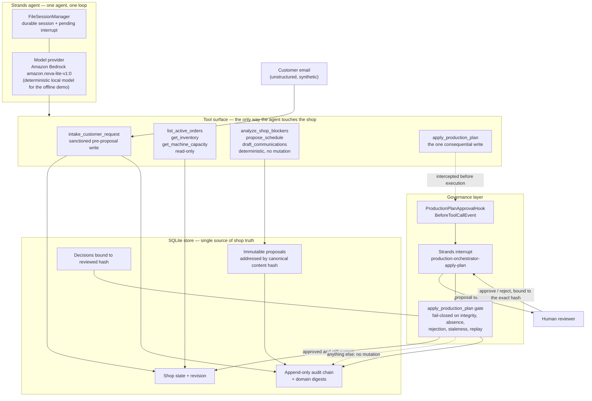
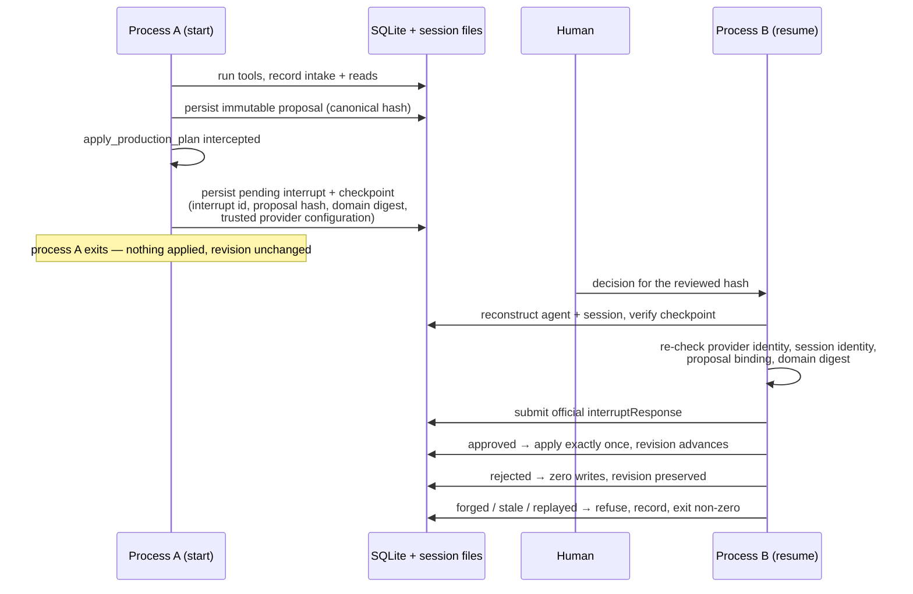

# Architecture

Production Orchestrator is a **governance layer for agent writes**, applied to production scheduling in a small decorated-apparel shop. The agent reads real shop state, reasons about it, and drafts work freely. Exactly one action can change the shop — and that action cannot execute until a human approves the specific, immutable proposal they reviewed.

The claim this architecture exists to prove:

> **Zero unapproved writes — provably fail-closed under forged, stale, and replayed inputs, across a real process boundary.**

Every box below is code in this repository. The "Where it is proven" table at the end maps each guarantee to the test or committed evidence file that demonstrates it, and marks the two guarantees still awaiting their gates.

## System

Two properties do the work:

**The model can extract, never assert.** Intake is the one place free text enters the system. The model reads the customer email and proposes structured fields; `intake.validate_extraction` then rejects anything it cannot verify against the catalog and calendar, and *derives* every shop fact deterministically — duration from quantity times minutes-per-unit, materials from per-unit consumption. A hallucinated product, a negative quantity, an unparseable day, or a malformed order id fails closed with zero domain mutation. The model never supplies a number the shop then believes.

**One write, one gate.** Seven of the eight tools cannot change shop state. The eighth, `apply_production_plan`, is intercepted by a `BeforeToolCallEvent` hook that raises a real Strands interrupt carrying the proposal summary, and the agent's own turn stops there. Approval is recorded against the exact canonical hash the human saw. Then `approval.apply_production_plan` re-derives the hash from the proposal's content and refuses to proceed if the content no longer matches its identity, if no decision exists, if the decision names a different hash, if the decision was a rejection, or if the shop's revision has moved since the proposal was cut.

## Approval across a process boundary

The interesting failure mode in production is not a hostile prompt — it is a restart. An operator reviews a proposal, the worker dies, and the approval arrives at a *different process* minutes later. The state that survives that gap is the state an attacker can forge.

The checkpoint is the trust boundary, so every field in it is re-verified rather than trusted: a wrong interrupt id, a different session identity, an altered proposal binding, a changed provider configuration, a domain digest that no longer matches, or a second use of an already-resumed interrupt each fail closed before any model call or write. A single helper, `_provider_configuration`, is the sole source of the provider identity that `start` persists and `resume` re-trusts — the two used to drift apart, which is exactly how the `bedrock-workflow` resume path was broken and fixed (issue #11, PR #16).

## Demo surfaces

| Surface | Command | Model | What it shows |
|---|---|---|---|
| Judge-facing web demo | `uv run production-orchestrator-demo` | deterministic local tool-calling model, no paid call | Customer email, live activity feed of the real eight-tool trail, before/after production board, unsent drafts, approve/reject, technical proof panel with hash, distinct process ids, and audit chain |
| Paired workflow spike | `production-orchestrator-spike` | Bedrock `amazon.nova-lite-v1:0` | Full workflow under the judged provider, rejection and exact-approval paths, committed evidence reports |
| Restart spike | `production-orchestrator-restart-spike start` / `resume` | Bedrock or deterministic, with or without intake | Two-process approval with the checkpoint gate; prints `INTERRUPT_ID`, `PROPOSAL_HASH`, and `WORKFLOW_PASSED` |

The web demo runs the identical tool sequence as the judged path with a deterministic model substituted for the provider, so it is honest to demonstrate offline and it costs nothing to replay. It binds to localhost, keeps transient state under the ignored `data/demo-runtime/`, prepares communications as unsent drafts, and ships no authentication, multi-tenancy, or external integration.

## Where it is proven

| Guarantee | Proof |
|---|---|
| Rejection or absent approval never mutates state | `tests/test_approval.py::test_missing_or_rejected_approval_never_mutates_domain_state`; `evidence/bedrock-rejection.json`, `evidence/bedrock-restart-rejection.json` (revision 1, no `plan_applied`) |
| Exact approval applies once, atomically, with audit | `test_exact_approval_atomically_applies_schedule_procurement_and_audit`; `evidence/bedrock-approval.json`, `evidence/bedrock-restart-approval.json` (revision 2, `plan_applied_count` 1) |
| Altered proposal content is refused even when its old hash was approved | `test_altered_plan_is_rejected_even_when_original_hash_was_approved` |
| Approval bound to a different hash is denied | `test_approval_for_a_different_reviewed_hash_is_denied` |
| Approved plan cannot be replayed after the revision advances | `test_approved_plan_cannot_be_replayed_after_revision_advances`; `test_resumed_interrupt_cannot_be_replayed` |
| State update rolls back if the audit append fails | `test_state_update_rolls_back_if_audit_append_fails` |
| A fresh process reconstructs the session and submits the official `interruptResponse` | `test_fresh_process_resumes_real_strands_interrupt`; `evidence/bedrock-restart-*.json` (`process_boundary_proven`, distinct start/resume pids) |
| Forged proposal hash is refused before any mutation | `test_workflow_provider_rejects_forged_proposal_before_mutation` |
| Wrong interrupt id, session identity, provider binding, or stale domain state fail closed after restart | `test_wrong_interrupt_id_fails_closed_after_restart`, `test_wrong_session_identity_fails_closed_after_restart`, `test_altered_provider_binding_fails_before_model_construction`, `test_recomputed_agent_id_cannot_override_trusted_resume_provider`, `test_stale_domain_state_fails_closed_after_restart` |
| Provider identity persisted at start is exactly what resume trusts | `test_provider_configuration_contract_is_shared_across_providers`, `test_bedrock_workflow_resume_accepts_its_own_checkpoint_configuration` |
| Invalid model extraction fails closed with zero domain mutation | `tests/test_intake.py` — unknown product, non-positive quantity, unknown day, out-of-range priority, malformed order id |
| Intake is atomic and audited with its post-intake digest | `test_persistence_add_order_is_atomic_and_audited` |
| **Live Bedrock extraction through the full intake workflow, both decisions** | **Pending** — issue #11; the rejection `start` leg already succeeded against live Bedrock, the resume leg was blocked by the defect fixed in PR #16 and is being re-run |
| **Deployed cloud execution with visible logs and session isolation** | **Pending** — issue #12 (Bedrock AgentCore Runtime); the honest fallback is the localhost demo plus committed deployment evidence |

Nothing in this document may be upgraded from Pending without a committed report from a real run. See [`DEVELOPMENT_CONTRACT.md`](../DEVELOPMENT_CONTRACT.md) for the evidence-honesty rules this file is bound by.
